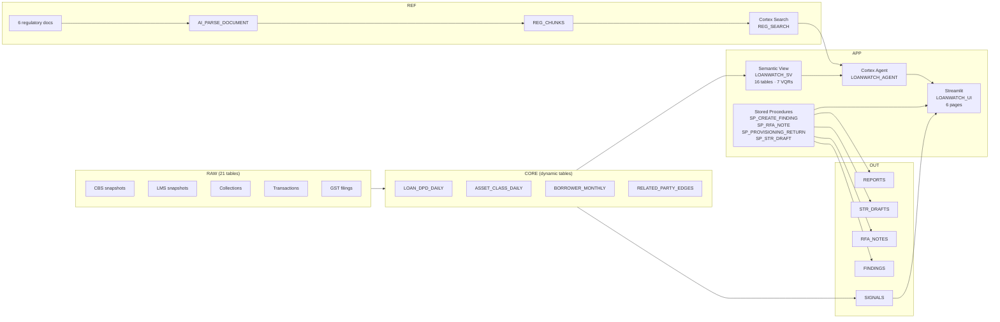

# LoanWatch

**Live demo (no login):** https://loanwatch-artemis.streamlit.app
**Repo:** https://github.com/ranjithaRnayak/loanwatch

Three engineers with no banking background built a regulator-grade early-warning copilot in four evenings with CoCo CLI. LoanWatch ingests a synthetic 2,000-borrower commercial loan book from three source systems (core banking, loan management, collections), reconciles them into governed dynamic tables applying RBI's IRACP 2025 rules, detects 12 categories of early-warning signals including fund diversion, evergreening and GST mismatches, and lets a risk officer ask questions in plain English — with every answer citing the source rows, the exact RBI paragraph, and the regulatory deadline.

## Architecture

## Track 1 — How LoanWatch maps to the judging criteria

| Criterion | How LoanWatch satisfies it | Snowflake features |
|-----------|---------------------------|-------------------|
| **Use Cortex AI to solve a real business problem** | A risk officer asks "Why is Meera Traders flagged?" and gets 7 cited early-warning signals, the related-party graph, and a draft RFA note. The agent answers questions with evidence and clause references; the four regulatory drafts are generated from the Actions page by design, so a human initiates every document. | Cortex Agent, Cortex Analyst (semantic view + VQRs), Cortex Search (RAG), AI_COMPLETE, AI_PARSE_DOCUMENT |
| **Demonstrate end-to-end data + AI pipeline** | Raw data from 3 source systems → governed dynamic tables (IRACP 2025 rules) → 12 EWS signal categories → AI-drafted regulatory paperwork. 6 regulatory documents (IRACP25, RSA25, FRM24, FRAUD16, KYC25, FIUIND) parsed, chunked into 641 chunks, and indexed for RAG. | Dynamic tables, ANOMALY_DETECTION, tasks (DAG), AI_PARSE_DOCUMENT, Cortex Search |
| **Production-grade governance and security** | 7 masking policies (PAN, GSTIN, account numbers, names, DOB, DIN), 2 row-access policies (region entitlement, STR principal-officer only), role-based access (LW_JUDGE for evaluators). | Masking policies, row-access policies, RBAC, Streamlit in Snowflake |

## Demo questions

These are pre-loaded in the app. Click any button to run it live.

1. **Which borrowers over 50 lakh show early-warning signals this quarter?**
2. **Why is Meera Traders flagged?**
3. **Show the transactions between Meera Traders and its related parties in the last 6 months.**
4. **What is our provisioning impact this month, and which accounts drove it?**
5. **How many SMA-2 accounts do we have?**
6. **Within how many days must a Red Flagged Account be reported on CRILC?**
7. **How does our gross NPA ratio compare to the system-wide ratio?**
8. **What are the system-wide bank fraud statistics for FY26?**

See [docs/sample_questions.md](docs/sample_questions.md) for the full set of 18 questions across three categories.

## How we differ

- **Loan-book anchoring.** Every answer is grounded in the actual governed loan book — not a generic LLM response. The semantic view exposes 16 logical tables with relationships and metrics.
- **Three-systems reconciliation.** The Overview page shows the same "How many SMA-2 accounts?" question answered four different ways — CBS, LMS, Collections, and Governed — to demonstrate why reconciliation matters.
- **Clause-cited outputs with deadlines.** Every signal, finding, and draft cites the specific RBI paragraph (e.g. `FRM24:4.1.3`, `IRACP25:44`) and computes regulatory deadlines (CRILC due date, examination deadline).
- **Rules as data.** The 47 EWS indicators, 13 IRAC rules, and 12 provision rates are stored as reference tables, not hardcoded. Adding a new rule is an INSERT, not a code change.
- **Drafts, never filed.** The copilot drafts RFA notes, provisioning returns, and STR narratives but never files them. Every draft is logged to the audit trail for a human to review.

## Note on RBI's November 2025 consolidation

On 28 November 2025, the Reserve Bank of India consolidated over 9,000 circulars into 238 Master Directions. LoanWatch stores each regulatory rule with its document code, clause reference, and effective status. Re-pointing from a legacy circular to its successor Master Direction is a data change in `REF.REG_DOCS` and `REF.REG_CHUNKS` — no code change required.

## Roadmap

- **Core-banking connectors.** Replace synthetic CSV loads with Openflow connectors to live CBS and LMS feeds.
- **Full 42 EWS indicators.** 47 indicators in REF.EWS_INDICATORS: 12 computable from the 2016 Annex II list plus 4 LoanWatch indicators; the rest reference-only. The remaining indicators follow the same pattern (reference table + view + signal merge).
- **Maker-checker approval on RFA notes.** Add a two-level approval workflow before an RFA note can be submitted to the fraud committee.
- **ECL readiness for April 2027.** RBI's Expected Credit Loss framework takes effect April 2027. The PROVISION_MONTHLY view and rates table are designed to swap from incurred-loss to ECL with a config change.

## Disclaimers

- **All data is synthetic.** Borrower names, PAN numbers, GSTINs, transaction amounts, and all other data are computer-generated. No real person or business is represented.
- **GST information is treated as an indicative external data feed.** In a production system, GST data would come from a licensed GSP. The synthetic GST tables simulate the schema and volume but not the content of real filings.

## Judge access

Two evaluator accounts have been created with role `LW_JUDGE` (read-only access to all LoanWatch objects):

| User | Email | Default role | Default warehouse |
|------|-------|-------------|-------------------|
| EVALUATOR1 | evaluator@hack2skill.com | LW_JUDGE | LW_APP_XS |
| EVALUATOR2 | hack2skillevaluator@gmail.com | LW_JUDGE | LW_APP_XS |

Passwords were communicated separately. The Streamlit app is at:
- **Snowflake:** `AI & ML → Streamlit → LoanWatch` (or search for `LOANWATCH_UI`)
- **Public demo:** https://loanwatch-artemis.streamlit.app

## References

- [PROMPTS.md](PROMPTS.md) — Full prompt log with outcomes for every CoCo CLI session.
- [docs/sample_questions.md](docs/sample_questions.md) — The 18 demo questions across three categories.
- [docs/REBUILD.md](docs/REBUILD.md) — Step-by-step rebuild instructions with expected row counts.
